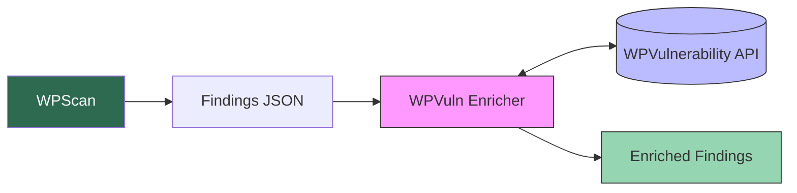
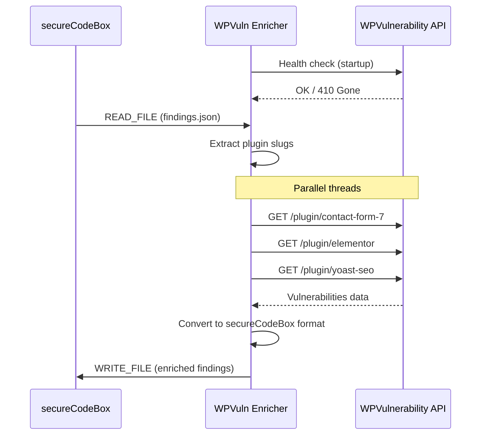
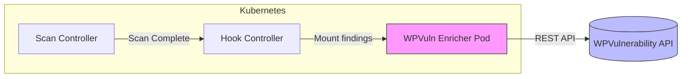
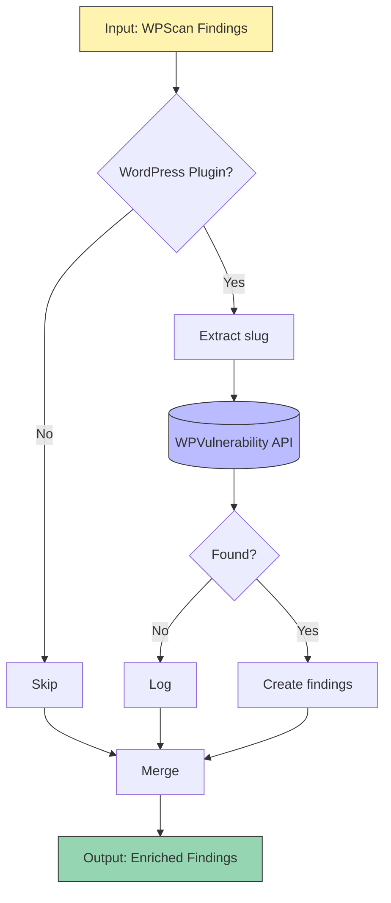

# WPScan WPVuln Enricher

[](https://github.com/venantvr-security/python-wpscan-wpvuln-enricher)
[](https://www.wpvulnerability.net/api/plugins/)
[](https://python.org/)
[](https://ghcr.io/venantvr-security/python-wpscan-wpvuln-enricher)

## Docker Image

```bash
docker pull ghcr.io/venantvr-security/python-wpscan-wpvuln-enricher:latest
```

A secureCodeBox hook that enriches WPScan findings with known vulnerability data from the [WPVulnerability API](https://www.wpvulnerability.net/).

## Overview

This hook automatically processes WPScan results and queries the WPVulnerability database to add detailed vulnerability information for each detected WordPress plugin.



## API Compatibility

| Enricher Version | API Version | API Endpoint | Status |
|------------------|-------------|--------------|--------|
| 1.0.0 | 2024-01 | `www.wpvulnerability.net` | Current |

> **Deprecation Detection**: The enricher performs an API health check at startup. If the API returns `410 Gone` or an incompatible response structure, the container will exit with an error message indicating an update is required.

## How It Works



## Features

- **Minimal dependencies** - Only `requests` library
- **Parallel processing** - Concurrent API calls using ThreadPoolExecutor
- **Automatic retry** - 3 retries with 2s delay on network failures
- **Distroless image** - Multi-stage build producing a secure container
- **Severity mapping** - Automatic classification based on CVSS severity
- **API deprecation detection** - Fails fast if API version is incompatible
- **Tests in Docker build** - Unit tests run during image build

## Severity Classification

Severity is derived from the CVSS score provided by the WPVulnerability API:

| CVSS Severity | secureCodeBox Severity |
|---------------|------------------------|
| CRITICAL | HIGH |
| HIGH | HIGH |
| MEDIUM | MEDIUM |
| LOW | LOW |

## Installation

### Prerequisites

- Kubernetes cluster with secureCodeBox installed
- WPScan scanner configured

### Deploy the Hook

```bash
kubectl apply -f hook.yaml
```

The hook will automatically attach to all scans with the label `scanType: wpscan`.

## Configuration

### Environment Variables

| Variable | Description | Default |
|----------|-------------|---------|
| `READ_FILE` | Path to input findings JSON | `/tmp/findings.json` |
| `WRITE_FILE` | Path to output enriched findings | `/tmp/findings.json` |

### Resource Limits

Default resource configuration in `hook.yaml`:

```yaml
resources:
  requests:
    memory: "64Mi"
    cpu: "50m"
  limits:
    memory: "128Mi"
    cpu: "200m"
```

## Architecture



## Output Format

The hook generates findings in secureCodeBox format:

```json
{
  "id": "550e8400-e29b-41d4-a716-446655440000",
  "name": "[WPVuln] Contact Form 7 - Reflected XSS",
  "description": "The plugin does not sanitize input properly. (fixed in 5.8.4)",
  "category": "WordPress Plugin Vulnerability",
  "location": "https://example.com",
  "osi_layer": "APPLICATION",
  "severity": "MEDIUM",
  "attributes": {
    "plugin_slug": "contact-form-7",
    "plugin_name": "Contact Form 7",
    "wpvuln_id": "a1b2c3d4-e5f6-7890-abcd-ef1234567890",
    "fixed_in": "5.8.4",
    "cvss_score": "6.1",
    "cve": ["CVE-2024-12345"],
    "cwe": ["CWE-79"],
    "references": ["https://www.cve.org/CVERecord?id=CVE-2024-12345"]
  },
  "false_positive": false
}
```

## Building

### Run Tests

```bash
pip install -r requirements.txt
pytest -v tests/
```

### Local Execution

```bash
pip install -r requirements.txt
python main.py
```

### Docker Build

Tests are automatically run during the Docker build. If tests fail, the build fails.

```bash
docker build -t python-wpscan-wpvuln-enricher:latest .
```

### Check Image Labels

```bash
docker inspect python-wpscan-wpvuln-enricher:latest --format='{{json .Config.Labels}}' | jq
```

Expected output includes:
```json
{
  "com.wpvulnerability.api-version": "2024-01",
  "org.opencontainers.image.version": "1.0.0"
}
```

## Usage Example

### Manual Execution

```bash
export READ_FILE=./examples/wpscan-findings.json
export WRITE_FILE=./enriched-findings.json
python main.py
```

### With secureCodeBox

```bash
# Run a WPScan
kubectl apply -f - <<EOF
apiVersion: execution.securecodebox.io/v1
kind: Scan
metadata:
  name: wpscan-example
  labels:
    scanType: wpscan
spec:
  scanType: wpscan
  parameters:
    - "--url"
    - "https://example.com"
EOF
```

The hook automatically enriches the results after scan completion.

## Startup Logs

On successful startup:
```
[INFO] WPVuln Enricher v1.0.0 (API version: 2024-01)
[INFO] Checking WPVulnerability API health...
[INFO] API health check passed
[INFO] Loaded 3 finding(s) from /tmp/findings.json
```

On API deprecation:
```
[INFO] WPVuln Enricher v1.0.0 (API version: 2024-01)
[INFO] Checking WPVulnerability API health...
[FATAL] API DEPRECATED: WPVulnerability API returned 410 Gone. This enricher version (1.0.0) is no longer compatible. Please update to a newer version
```

## Data Flow



## Project Structure

```
.
├── main.py                 # Main application code (commented for beginners)
├── requirements.txt        # Python dependencies
├── Dockerfile              # Multi-stage Docker build (distroless)
├── hook.yaml               # secureCodeBox hook manifest
├── README.md               # This file
├── docs/
│   └── DOCKER.md           # Docker commands cheat sheet
├── tests/
│   ├── test_main.py        # Unit tests (15+ tests with pytest)
│   └── test_parser.py      # Parser unit tests
├── examples/
│   ├── wpscan-findings.json           # Sample WPScan input
│   └── wpvulnerability-api-response.json  # Sample API response
└── postman/
    └── WPVulnerability-API.postman_collection.json  # Postman collection
```

## License

MIT

## Related Projects

- [secureCodeBox](https://github.com/secureCodeBox/secureCodeBox)
- [WPScan](https://wpscan.com/)
- [WPVulnerability API](https://www.wpvulnerability.net/)
